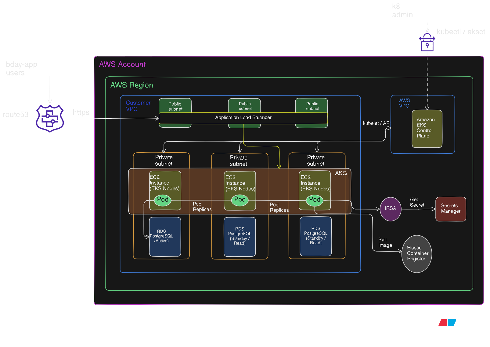

# Birthday API APP

This project contains the files for the deployment of an API based on FastAPI and relies on PostgreSQL for store data.

## The requirement

1. Code a simple application that exposes the following HTTP based APIs:

    **Description**: Save/updates a given user name and date of birth in a database.  
    **Request**: PUT `/hello/<username>` `{ “dateOfBirth”: “YYYY-MM-DD” }`  
    **Response**: 204 No Content

    **Note**:
    - Username should only be letters.  
    - YYYY-MM-DD must be a date before today's date.

    **Description**: Returns a birthday message  
    **Request**: GET `/hello/<username>`  
    **Response**: 200 ok  
    **Response examples**:  
    1. If username's birthday is in N days  
    `{ “message”: “Hello, <username>! Your birthday is in N day(s)”}`
    2. If username's birthday is today  
    `{ “message”: “Hello, <username>! Happy birthday!” }`

    **Note**:
    - Use the storage or DB of your choice.

2. Code a simple helm chart and deploy this application into a small local kubernetes cluster
(like minikube or k3s)

3. Produce a system diagram of how this solution would be deployed into AWS. You can consider that the application is of high criticality and high usage, so add all the components you deem required to achieve a strong and resilient infrastructure.

## Quick start

### Project files structure

```text
.
├── charts/                 # Kubernetes Helm Charts
│   ├── hello-api/          # Chart for the FastAPI application
│   └── postgres-db/        # Chart for the PostgreSQL database
├── main.py                 # FastAPI application routes and logic
├── models.py               # SQLModel/Pydantic data schemas
├── database.py             # Database engine and session configuration
├── requirements.txt        # Python dependencies
├── Dockerfile              # Container definition for the API
├── .dockerignore           # Files excluded from the Docker build
├── .gitignore              # Files excluded from Git (venv, pycache, etc.)
└── README.md               # Project documentation
```

#### 1. Start minikube cluster using calico and enabling NGINX ingress

`minikube start --cpus 4 --memory 8192 --cni=calico`  

`minikube addons enable ingress`

#### 2. Clone the git repo

`git clone git@github.com:mviamonte/bday-api-helm-chart.git`

#### 3. Build the image and push it to minikube

`docker build -t hello-api:v1 .`  
`minikube image load hello-api:v1`

#### 4. Deploy infrastructure

`helm upgrade --install db-release ./charts/postgres-db -n db-space`
`helm upgrade --install api-release ./charts/hello-api -n app-space`

#### 5. Accessing the API

`echo "$(minikube ip) hello-world.local" | sudo tee -a /etc/hosts`

#### 6. Create registers and examples of the application working

`curl -X 'PUT' 'http://hello-world.local/hello/bilbo' -H 'Content-Type: application/json' -d '{"dateOfBirth": "2000-10-01"}'`  -- This is a valid entry

`curl -X 'PUT' 'http://hello-world.local/hello/bilbo' -H 'Content-Type: application/json' -d '{"dateOfBirth": "2000-1-01"}'`  -- This is NOT a valid entry. Date format is not correct

`curl -X 'PUT' 'http://hello-world.local/hello/bilbo1234' -H 'Content-Type: application/json' -d '{"dateOfBirth": "2000-1-01"}'`  -- This is NOT a valid entry. There is a pattern mismatch in the username

`curl -i http://hello-world.local/hello/bilbo` -- This will show the days remaining for the birthday in N days

`curl -i http://hello-world.local/hello/luciana`  -- 404 Not Found

## The solution

### 1- Code a simple application

### API

- The API, could be access using `http://hello-world.local/`
- Documentation (Swager) of the API could be seen at `docs`
- Main stack is based on `Python` and `FastAPI` framework
- API application and  required libraries are loaded and built based on Docker technology.
- Data validation:
  - Using different `Pydantic` and `Python` native libraries, to ensure data consistency and validation based on the initial requirement.

### Database

- Uses `PostgreSQL` to store the data
- Data validation:
  - Using `SQLModel`, to ensure data consistency, validation and persistency.

### 2 - Create Helm charts

The helms charts featured:

- **Namespace separation:** For stack segregation and deployment independence of each application component (API and DB)
- **Chart isolation approach:** There are two charts, `hello-app` and `postgres`.
- **Autoscaling:** Configuration of the HPA based on CPU use.
- **Security:** NetworkPolicies at namespace level for database namespace `db-space` allowing only traffic from `app-space` and from the specific `hello-api` pod tags.
- **Governance:** Uses `ResourceQuotas` to control the use of resources and limits for the deployments at namespace level.
- **Data persistency:** Using Persistent volumes and Persistent Volume Claims to guarantee data persistency at database level.

### 3 - AWS Diagram and resilient approach

#### AWS Diagram



To migrate this solution to a cloud environment in AWS, along with account  bootstraping:

- Organizations
- SCP definitions
- VPC
- Kubernetes deployment model (EKS) and Node Groups for Workers
- IAM definitions
- Connectivity to interact with the Control Plane (VPN)  

The solution will need:

**API Authentication:** A security layer for authentication on the API.

**Compute (EKS):** A managed Kubernetes cluster using **Karpenter** for node autoscaling.

**Database (RDS):** Rule of thumb recommends the use of **Amazon RDS for PostgreSQL (Multi-AZ)** instead of container approach. Additionally this adds automated backup, replication and storage encryption.

**Networking:**

- **AWS Load Balancer Controller:** To manage an Application Load Balancer (ALB) with SSL/TLS termination via **AWS Certificate Manager (ACM)**.  
- **ExternalDNS:** To automatically synchronize Kubernetes Ingress resources with **Route 53** records.  

**Observability:** Track metrics, logs and traces from the API and database to an observability layer and add instrumentation for:

- Latency from GET /hello
- Request per seconds
- 400 errors where the users is not found
- Data validation errors for string formats (user and date format)

**CI/CD:** Add a pipeline on a CI/CD tool like Github actions for:

- Code linting (error prevention) and code consistency
- Secret scanning
- Libraries dependencies

**GitOps approach:** Rely on tools like ArgoCD to automate the deployments.

**Security & Secrets:**

- **External Secrets Operator:** To securely inject database credentials from, it could be AWS Secret Manager.
- **IAM Roles for Service Accounts (IRSA):** Following the principle of least privilege for Pod permissions.  

**Addons:**

- VPC CNI
- CoreDNS
- AWS Load Balancer Controller
- ExternalDNS
- Karpenter
- External Secrets Operator
- Metrics Server

### 4 - Extendend command list for troubleshooting and common issues

#### Helm useful commands

Here a list of commands, where the placeholder {app-component} can be replaced for either `hello-api` or `postgres-db`.
To verify format of the files on each chart  
`helm lint ./charts/{app-component}/`  

To dry-run the installation, before install  
`helm install --dry-run --debug {releasename} ./charts/{app-component}/`  

To install the first time  
`helm upgrade --install {releasename} ./charts/{app-component} -n {namespace} --create-namespace`  

To keep track of the historic releases  
`helm history {releasename} -n {app-component}`  

#### Kubernetes commands  

Network policy verification  
`kubectl get networkpolicy -A`

Verify quota resources  
`kubectl get resourcequota -n {namespace}`

Check HPA status  
`kubectl get hpa -n {namespace}`

Get pods in a namespace  
`kubectl get pods -n {namespace} -w`

Get details about a pod  
`kubectl describe pod -l app={app-component} -n {namespace}`

Obtain logs from a pod  
`kubectl logs -l app={app-component} -n {namespace} --tail=10`
